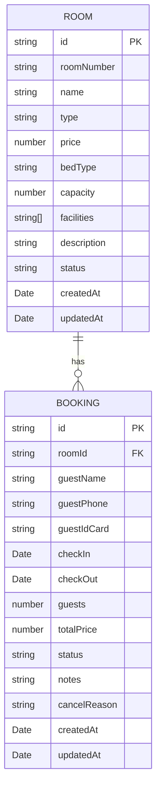

## 1. 架构设计
本系统为纯前端单页应用，数据持久化使用浏览器 localStorage，无需后端服务。

```mermaid
graph TD
    "浏览器" --> "React SPA (Vite)"
    "React SPA" --> "Zustand 状态管理"
    "Zustand 状态管理" --> "localStorage 持久化"
    "React SPA" --> "页面组件层"
    "页面组件层" --> "仪表盘"
    "页面组件层" --> "房间管理"
    "页面组件层" --> "日历视图"
    "页面组件层" --> "预订管理"
    "页面组件层" --> "公共组件（弹窗/表单/卡片）"
```

## 2. 技术描述
- 前端框架：React@18 + TypeScript
- 构建工具：Vite@5
- 样式方案：Tailwind CSS@3
- 状态管理：Zustand@4
- 路由管理：React Router Dom@6
- 图标库：Lucide React
- 日期处理：date-fns
- 数据持久化：localStorage + zustand persist 中间件
- 后端：无（纯前端）
- 数据库：无（localStorage 模拟）

## 3. 路由定义
| 路由 | 页面 | 用途 |
|------|------|------|
| / | Dashboard | 首页仪表盘，统计概览与快捷操作 |
| /rooms | RoomList | 房间档案列表与管理 |
| /calendar | Calendar | 月历视图，查看房间占用情况 |
| /bookings | BookingList | 预订列表与管理 |

## 4. 数据模型

### 4.1 ER 图


### 4.2 TypeScript 类型定义
```typescript
// 房间类型
export type RoomType = 'standard' | 'deluxe' | 'suite' | 'family';
export type BedType = 'single' | 'double' | 'twin' | 'king';
export type RoomStatus = 'active' | 'maintenance' | 'inactive';

export interface Room {
  id: string;
  roomNumber: string;
  name: string;
  type: RoomType;
  price: number;
  bedType: BedType;
  capacity: number;
  facilities: string[];
  description: string;
  status: RoomStatus;
  createdAt: string;
  updatedAt: string;
}

// 预订类型
export type BookingStatus = 'confirmed' | 'checked-in' | 'checked-out' | 'cancelled';

export interface Booking {
  id: string;
  roomId: string;
  guestName: string;
  guestPhone: string;
  guestIdCard?: string;
  checkIn: string;
  checkOut: string;
  guests: number;
  totalPrice: number;
  status: BookingStatus;
  notes?: string;
  cancelReason?: string;
  createdAt: string;
  updatedAt: string;
}

// Store 状态
export interface AppState {
  rooms: Room[];
  bookings: Booking[];
  addRoom: (room: Omit<Room, 'id' | 'createdAt' | 'updatedAt'>) => void;
  updateRoom: (id: string, room: Partial<Room>) => void;
  deleteRoom: (id: string) => boolean;
  addBooking: (booking: Omit<Booking, 'id' | 'createdAt' | 'updatedAt'>) => void;
  updateBooking: (id: string, booking: Partial<Booking>) => void;
  cancelBooking: (id: string, reason: string) => void;
  getBookingsByRoom: (roomId: string) => Booking[];
  getBookingsByDate: (date: string) => Booking[];
  isRoomAvailable: (roomId: string, checkIn: string, checkOut: string, excludeBookingId?: string) => boolean;
}
```

## 5. 项目目录结构
```
src/
├── components/          # 公共组件
│   ├── Layout.tsx       # 布局组件（侧边栏+内容区）
│   ├── Modal.tsx        # 弹窗组件
│   ├── Button.tsx       # 按钮组件
│   ├── Card.tsx         # 卡片组件
│   ├── Badge.tsx        # 标签组件
│   └── Input.tsx        # 表单输入组件
├── pages/               # 页面组件
│   ├── Dashboard.tsx    # 仪表盘
│   ├── RoomList.tsx     # 房间管理
│   ├── RoomForm.tsx     # 房间表单
│   ├── Calendar.tsx     # 日历视图
│   ├── BookingList.tsx  # 预订列表
│   └── BookingForm.tsx  # 预订表单
├── store/               # 状态管理
│   └── useAppStore.ts   # Zustand store
├── types/               # 类型定义
│   └── index.ts         # 全局类型
├── utils/               # 工具函数
│   ├── date.ts          # 日期处理函数
│   └── mockData.ts      # 初始模拟数据
├── App.tsx              # 根组件
├── main.tsx             # 入口文件
└── index.css            # 全局样式
```

## 6. 核心工具函数说明
| 函数名 | 用途 |
|--------|------|
| `formatDate(date, pattern)` | 日期格式化 |
| `getMonthDays(year, month)` | 获取某月所有日期 |
| `isSameDay(d1, d2)` | 判断是否同一天 |
| `isDateInRange(date, start, end)` | 判断日期是否在区间内（含边界） |
| `isRoomAvailable(roomId, checkIn, checkOut)` | 检查房间在指定日期段是否可用 |
| `getRoomStatusOnDate(roomId, date)` | 获取房间在指定日期的状态 |
| `calculateNights(checkIn, checkOut)` | 计算入住晚数 |
| `generateId()` | 生成唯一 ID |
